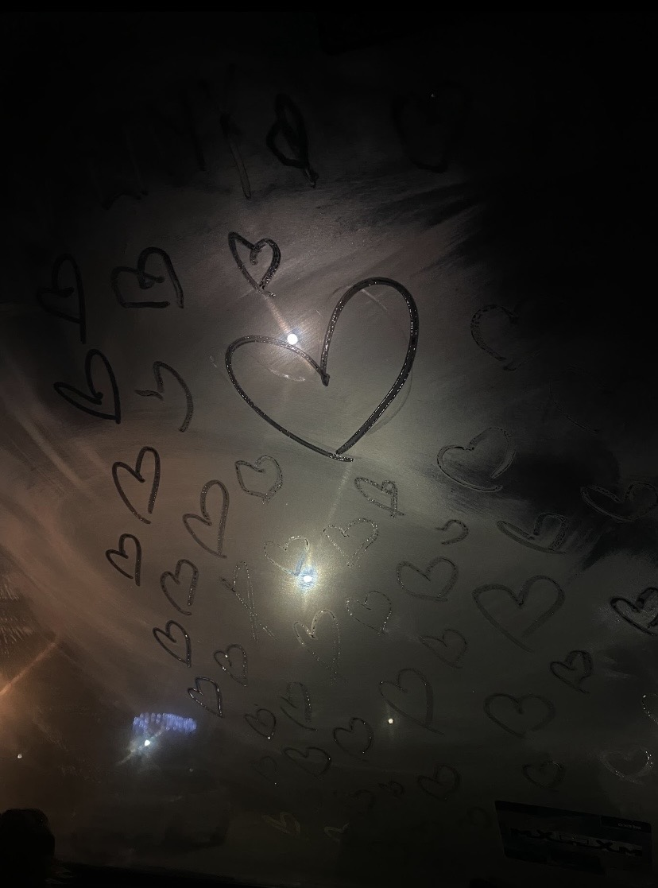

<!DOCTYPE html>  
<html lang="es">  
<head>  
<meta charset="UTF-8">  
<title>Para mi nubecita 🌷</title>  
  
  
</head>  
  
<body>  
  

  
  <h1 class="anim">Para “mi nubecita 🌷”</h1>  
  
  
  
    Por esto y más te amo 💖  
  
  
  
  
Ojalá, amor, cada vez que te mires las manos
  
  
sientas que te faltan las mías.
  
  
  
  
      
    
“La primera de nuestras tantas visitas &lt;3”
  
  
  
  
  
  
      
    
“Aquí veía a mi nubecita con sus nubecitas, estaban que me brillaban los ojos 🩷”
  
  
  
  
  
  
      
    
“Este día nuestros cuerpos decidieron hablar antes que nuestra boca 😉”
  
  
  
  
  <button onclick="activar()">Toca aquí… 💌</button>  
  
  
  
    Aun y con la distancia que hay en estos momentos,    
    te sigo sintiendo cerca de mi corazón… te amo 💖  
  
  
  
  <!-- CIERRE FINAL -->  
  
Para siempre, tuyo… 💌
  
  
  <iframe id="yt"  
  width="0" height="0"  
  src=""  
  frameborder="0"  
  allow="autoplay">  
  </iframe>  
  

  
  
  
  
</body>  
</html>  
